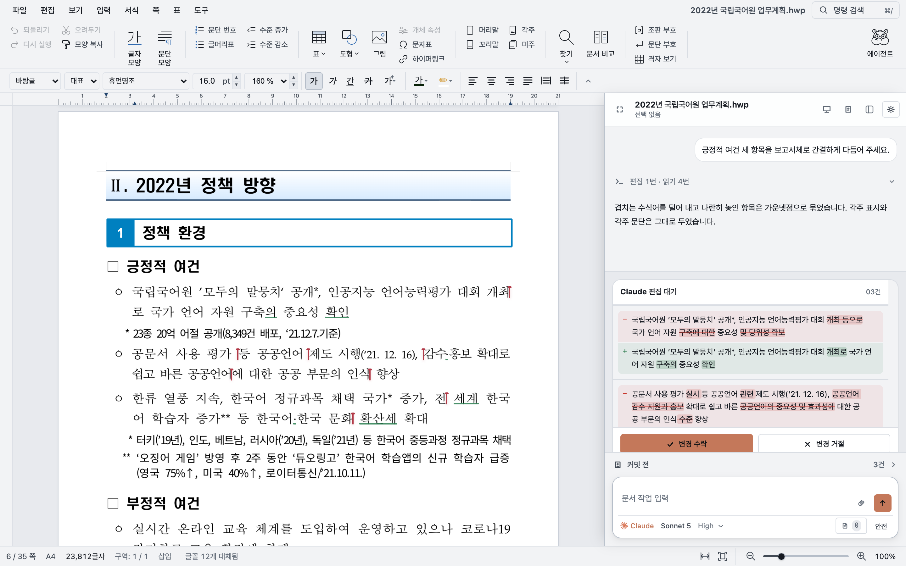

<p align="center">
  
</p>

<h1 align="center">Rauhwpx</h1>

<p align="center">
  <a href="README.md">한국어</a> · English
</p>

<p align="center">
  An HWP/HWPX editor with an AI agent that edits the document you have open.<br />
  Rust and WebAssembly document engine, desktop app and web editor.
</p>

<p align="center">
  A fork of Edward Kim's <a href="https://github.com/edwardkim/rhwp">edwardkim/rhwp</a>.
</p>

<p align="center">
  
</p>

## What this is

Rauhwpx opens and edits Korean HWP/HWPX documents. The Rust engine handles parsing, layout, rendering and editing; the agent sidebar connects supported AI providers to the open document through MCP tools.

Document editing runs on your machine. AI requests send prompts and any document content read by the agent to your selected provider. Web research and the optional Browserbase integration also use external services. The local agent hub manages provider sessions, permissions, downloads and tool routing.

## Editor

- HWPX is the default format for new documents. HWP 5.0, HWPX and HML support reading and writing; HWP3 is read-only. Opened `.hwp` files keep binary HWP on Save. The documents in `rhwp/samples/` provide round-trip and rendering regression coverage; compatibility varies by document and feature.
- Layout and rendering include pagination, 어울림 wrap, tables with page splitting, footnotes/endnotes, equations, shapes, charts and embedded objects, drawn to Canvas2D/CanvasKit in the browser and Skia natively.
- Editing includes character/paragraph/style dialogs, tables, list numbering, fields and forms, page setup, find/replace, document compare, revision history, undo throughout.
- Save the document and its complete revision graph as one cross-platform `.rhwpx` archive. Older folder bundles remain available through the separate legacy import command.
- Export to SVG, PNG, PDF, text, Markdown, table dumps, plus HWPX/HML conversion from the CLI.

## Agent

Claude, Codex, and Pi can each drive the open document. Semantic reads and writes cover common work. `apply_edits` applies up to 32 changes in one atomic call. Registry-generated engine batches cover classified mutations.

Staged edits appear in the document. **안전** holds successful edits for review. **전체 접근** commits them as one undo step. A failed turn restores the prior snapshot. In plan mode the document stays read-only until you approve.

Every read returns a `revision`. Every write requires it. Stale writes fail instead of corrupting the document.

The live tool list lives in `rhwp/rhwp-agent/tools.mjs`. `rhwp/rhwp-agent/tests/tools.test.mjs` pins the count.

## Install

Download a build from [Releases](https://github.com/heemangstudio/Rauhwpx/releases): macOS arm64 DMG/ZIP, Windows x64 installer, or Linux x64/arm64 AppImage and Debian package. macOS builds are signed. Windows builds are currently unsigned and can trigger SmartScreen warnings.

Windows installs per user by default. The installer detects an older all-users installation and requests elevation to upgrade it instead of creating a second copy.

Saving over an existing desktop file uses a crash-safe compare-and-swap and requires hard-link support on that volume. FAT/exFAT, some SMB shares, and some cloud-synced volumes may reject the save without changing the original; use a local APFS or NTFS volume, or Save As to a supported destination. On Windows, preserving the original file's access rules also requires the built-in System32 Windows PowerShell. If both publication and rollback fail, Rauhwpx keeps an openable recovery copy and reports its exact path.

Testers on macOS and Windows can use the [nightly](https://github.com/heemangstudio/Rauhwpx/releases/tag/nightly) pre-release. Artifact names use `<version>-nightly.<date>.<sha>`, with a UTC `YYYYMMDD` date and the first seven SHA characters.

Connect a provider from **Settings → Connection**. Claude, Codex, and Pi can be installed there, and the app offers each provider's supported sign-in method.

## Development

Install Node 22.18 or newer, Rust via rustup, and wasm-pack 0.15.0. From the repository root:

```sh
npm run setup
npm run build:wasm
npm run dev:studio
```

Open http://127.0.0.1:7700. Studio starts its own authenticated agent hub on an ephemeral port. To attach Electron to that dev server, run `npm run dev:desktop` in another terminal.

See [CONTRIBUTING.md](CONTRIBUTING.md) for native builds, focused tests and prerequisites. Maintainers can find signing and publishing instructions in [docs/releasing.md](docs/releasing.md).

### Sidebar design preview

Run `npm --prefix rhwp/rhwp-studio ci` once, then `npm run dev:sidebar` and open
http://127.0.0.1:7715. This mounts the production sidebar with local service fixtures;
Node is the only runtime prerequisite. `npm run test:sidebar` checks its interactions
in headless Chrome and saves sidebar screenshots. See the
[preview guide](rhwp/rhwp-studio/sidebar-preview/README.md) for scenarios and design editing.

## Layout

| Path | What |
| --- | --- |
| `rhwp/src/` | Rust engine |
| `rhwp/rhwp-studio/` | Web editor and agent sidebar |
| `rhwp/rhwp-agent/` | Local WS hub |
| `desktop/` | Electron shell |
| `rhwp/rhwp-{chrome,firefox,safari,vscode}/` | Viewer extensions |
| `rhwp/npm/editor/` | Embeddable editor package |

## License

[MIT](rhwp/LICENSE). 한글, 한컴, HWP, and HWPX are Hancom trademarks. This project is not affiliated with Hancom.
