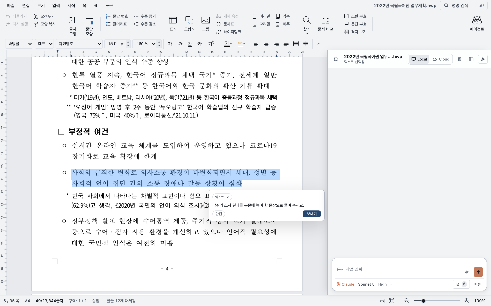
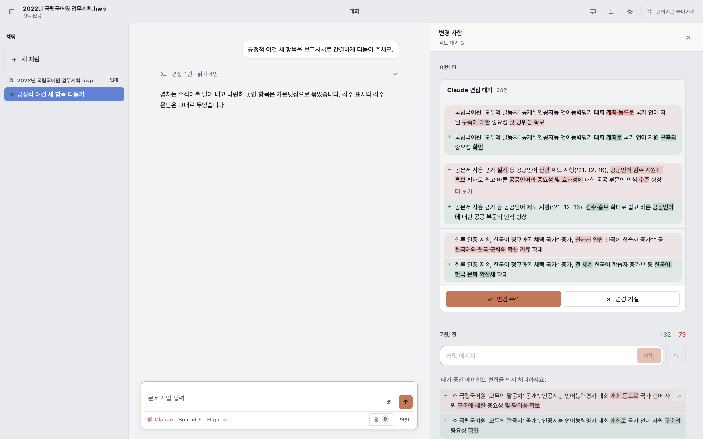
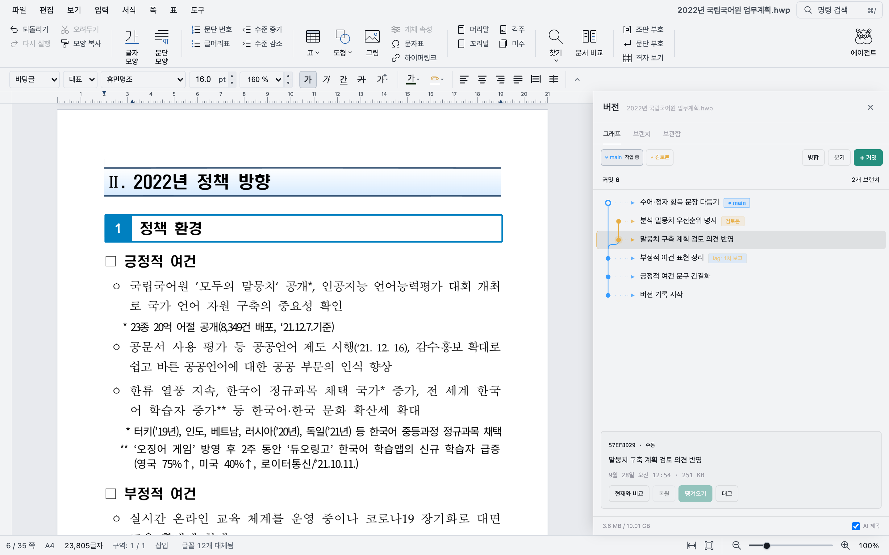

<p align="center">
  
</p>

<h1 align="center">Rauhwpx</h1>

<p align="center">
  AI가 직접 고치는 한글 문서 편집기
</p>

<p align="center">
  <a href="https://github.com/heemangstudio/Rauhwpx/releases/latest"></a>
  
  
  <a href="rhwp/LICENSE"></a>
</p>

<p align="center">
  <a href="https://github.com/heemangstudio/Rauhwpx/releases/latest"><b>다운로드</b></a>
  &nbsp;·&nbsp;
  <a href="CONTRIBUTING.md">기여 안내</a>
  &nbsp;·&nbsp;
  <a href="https://github.com/heemangstudio/Rauhwpx/issues">이슈</a>
  &nbsp;·&nbsp;
  <a href="README.en.md">English</a>
</p>

<br />

<picture>
  <source media="(prefers-color-scheme: dark)" srcset="rhwp/assets/screenshots/readme/hero-dark.png" />
  
</picture>

<br />
<br />

`.hwp`와 `.hwpx` 문서를 열고, 직접 고치거나 옆의 사이드바에서 AI에게 맡깁니다. AI가 바꾼 내용은 문서 위에 바로 표시되고, 확인한 것만 남깁니다. AI를 연결하지 않아도 편집기로 쓸 수 있습니다.

## 이렇게 씁니다

<table>
  <tr>
    <td width="50%" valign="top">
      
      <br />
      <b>고칠 곳을 고르고 말합니다</b>
      <br />
      <sub>문단을 선택하면 그 자리에서 요청을 적을 수 있습니다. 선택한 내용은 대화에 함께 전달됩니다.</sub>
    </td>
    <td width="50%" valign="top">
      
      <br />
      <b>바뀐 곳만 확인합니다</b>
      <br />
      <sub>AI의 편집은 승인하기 전까지 검토 대기로 남습니다. 바뀐 문장을 전후로 비교한 뒤 수락하거나 거절합니다.</sub>
    </td>
  </tr>
</table>



**수정의 흐름도 남깁니다.** 버전 기록을 켜면 실행 취소와 별개로 이전 상태를 다시 열어 볼 수 있고, 다른 방향의 수정안을 분기로 나눠 작업할 수 있습니다. 문서와 이력 전체는 `.rhwpx` 파일 하나로 보관합니다.

## 설치

[최신 릴리스](https://github.com/heemangstudio/Rauhwpx/releases/latest)에서 운영체제에 맞는 파일을 받습니다.

| 운영체제 | 파일 | |
| --- | --- | --- |
| macOS · Apple Silicon | `.dmg` | 서명·공증 |
| Windows · x64 | `.exe` | 미서명, SmartScreen 경고가 뜰 수 있음 |
| Linux · x64, arm64 | `.AppImage` `.deb` | |

## AI 연결

**설정 → 연결**에서 쓸 AI를 고르면 설치와 로그인까지 앱이 안내합니다.

| 연결 | 방식 |
| --- | --- |
| Rau | Rau 계정의 크레딧으로 모델을 사용합니다 |
| Claude · Codex | 각 도구의 계정과 인증을 그대로 연결합니다 |
| Pi | OpenRouter 키와 모델 설정을 사용합니다 |

권한은 두 가지입니다. **안전**에서는 AI의 편집이 검토 대기로 남고, **전체 접근**에서는 한 번의 실행 취소로 되돌릴 수 있는 묶음으로 바로 반영됩니다. 처음에는 안전으로 작은 문단부터 맡겨 보는 편이 좋습니다.

> [!NOTE]
> 문서 엔진은 내 컴퓨터에서 동작하지만, AI 요청에는 문서 내용과 참고 자료가 포함되어 연결한 서비스로 전송됩니다.

<details>
<summary><b>이런 요청부터 해 보세요</b></summary>
<br />

> 선택한 문단을 보고서 문체로 다듬어 주세요. 숫자와 고유명사는 그대로 두세요.

> 참고 자료를 읽고 이 표의 빈 설명 칸을 채워 주세요. 근거가 없는 칸은 비워 두세요.

> 문서는 고치지 말고 핵심 내용과 더 확인할 부분만 정리해 주세요.

</details>

## 지원 형식

| 형식 | 열기 | 편집·저장 |
| :-- | :-: | :-: |
| HWPX | ● | ● |
| HWP 5.0 | ● | ● |
| HML | ● | ● |
| HWP 3.0 | ● | |

새 문서는 HWPX로 저장합니다. 암호나 DRM이 걸린 문서는 열 수 없고, 문서에 따라 글꼴이나 쪽 나눔이 한컴 오피스와 다르게 보일 수 있습니다. 중요한 파일은 사본으로 먼저 작업하는 편이 안전합니다. 앱에서는 PDF로 저장할 수 있고, CLI로는 PNG·SVG·텍스트·마크다운도 내보냅니다.

## 개발

<details>
<summary><b>코드로 실행하기</b></summary>
<br />

Node.js 22.18 이상, rustup으로 설치한 Rust, wasm-pack 0.15.0이 필요합니다. Rust 버전과 WASM 타깃은 [`rhwp/rust-toolchain.toml`](rhwp/rust-toolchain.toml)이 고정합니다.

```sh
git clone https://github.com/heemangstudio/Rauhwpx.git
cd Rauhwpx

cargo install wasm-pack --version 0.15.0 --locked
npm run setup
npm run build:wasm
npm run dev:studio
```

편집기는 http://127.0.0.1:7700 에서 열리고 에이전트 허브도 함께 뜹니다. 다른 터미널에서 `npm run dev:desktop`을 실행하면 같은 개발 서버에 Electron 창이 붙습니다.

데스크톱 앱 전체를 빌드해 실행할 때는 다음 명령을 씁니다.

```sh
npm run build:desktop
npm run desktop
```

검사는 바꾼 영역에 맞춰 고릅니다. 자세한 절차는 [기여 안내](CONTRIBUTING.md)에 있습니다.

```sh
npm run test:ci
npm --prefix rhwp/rhwp-studio test
npm --prefix rhwp/rhwp-agent test
```

</details>

<details>
<summary><b>저장소 구조</b></summary>
<br />

| 경로 | 내용 |
| --- | --- |
| [`rhwp/src/`](rhwp/src/) | Rust 문서 엔진. 파싱, 문서 모델, 조판·렌더링, 저장 |
| [`rhwp/rhwp-studio/`](rhwp/rhwp-studio/) | TypeScript 편집기와 AI 사이드바 |
| [`rhwp/rhwp-agent/`](rhwp/rhwp-agent/) | 로컬 허브. AI 연결, 인증, MCP 도구 |
| [`desktop/`](desktop/) | Electron 셸 |
| [`rhwp/rau-credits/`](rhwp/rau-credits/) | Rau 계정과 크레딧 연동 |
| `rhwp/rhwp-{chrome,firefox,safari,vscode}/` | 뷰어 확장 |

AI가 문서를 고칠 때는 허브가 MCP 도구 호출을 편집기로 넘기고, 편집기가 열린 문서에 적용합니다. 모든 읽기는 `revision`을 돌려주고 모든 쓰기는 그 값을 요구하므로, 그사이 문서가 바뀌었다면 쓰기가 거절됩니다. 도구 목록은 [`rhwp/rhwp-agent/tools.mjs`](rhwp/rhwp-agent/tools.mjs)에 있습니다.

</details>

## 함께 다듬기

잘 열리지 않는 문서나 저장 후 달라지는 부분은 [이슈](https://github.com/heemangstudio/Rauhwpx/issues)로 알려 주세요. 운영체제, 앱 버전, 기대한 결과와 실제 결과를 적어 주시면 확인이 빠릅니다. 재현용 파일은 개인정보를 지우고 올려 주세요.

## 라이선스

[Edward Kim의 rhwp](https://github.com/edwardkim/rhwp)에서 출발한 프로젝트입니다. [MIT](rhwp/LICENSE) 라이선스를 따르며, 함께 쓰는 구성 요소는 [서드파티 라이선스](rhwp/THIRD_PARTY_LICENSES.md)에 정리되어 있습니다.

<sub>한글, 한컴, HWP, HWPX는 한글과컴퓨터의 상표입니다. 이 프로젝트는 한글과컴퓨터와 관계가 없습니다.</sub>
