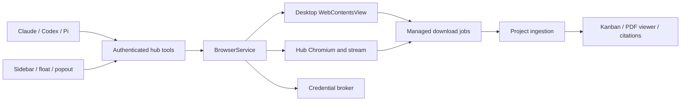

# App-owned browser plan

Status: implementation authorized and built in an isolated laptop worktree. The acceptance scenarios below distinguish required behavior from the recorded verification in `docs/pr-evidence/owned-browser/README.md`.

Base: PR #477, branch `fix/pr475-memo-errors`. Planning and before screenshots used `f7e6c10e1f2f3721507f978ec83a23abdf5b4e5e`; delivery is stacked on its current head `96cbdafeba10569ab73c5190fb99b7ad1e3cfb3c`, which additionally updates a browser review test. Worktree: `/Users/hataewook/projects/hobbies/Rauhwpx-owned-browser`, branch `feat/owned-browser`. The original checkout and other worktrees remain untouched. Source review began at `cd83a4fc71f17b0ffe79acfa8a319b28bad45ecf`; the intervening document-home layout changes preserve the browser integration contracts.

## Confirmed requirements

- Remove Browserbase from the shipping application, configuration, dependencies, and agent instructions.
- Provide an app-owned browser for Electron desktop and web clients.
- Run browsers and store their data on the user's own hub. The product is local-focused; hosted HamaEditor browser services are excluded.
- Add Browser to PR #477's sidebar workbench beside Board, Changes, Agents, and Documents.
- Support docked, floating, and popped-out previews with complete navigation and collaboration controls.
- Make the in-app draggable PiP panel the primary floating experience, with compact SVG icons and minimal text. Keep the optional separate window in the overflow menu and runtime diagnostics collapsed.
- Keep the browser reachable by authorized agents through background chats, hidden previews, and presentation changes.
- Ask to save or use credentials through the existing chat permission interaction. Store approved credentials securely, fill them through the browser, and retain login sessions for later use.
- Share website logins across every project on the same user-owned hub. Retain saved credentials and session state through restarts and upgrades for the installed lifetime of the app, with explicit user sign-out/forget actions and supported uninstall cleanup.
- After the user approves a website/account, agents reuse that approval automatically in future chats across projects. Provide a separate Browser section in Settings for password/account management and browser configuration.
- Concurrent agents receive separate tabs while sharing the user's saved logins. Keep tab actions, human control, and research destinations bound to the owning agent/chat/project.
- Connect research captures and authenticated PDF downloads to project Kanban cards and the existing PDF viewer and citation tools.
- Make completed downloaded PDFs automatically available in the app through local managed storage and the existing PDF viewer. Project downloads also create a Kanban reference entry; linking an existing task uses captured task context when available.
- Save downloads made without a project to a general local Downloads inbox. They remain viewable in the app and can be moved into a project later without downloading again.
- Enable ordinary research browsing and downloads by default at startup. Include Google search, Drive/Slides reading, Wikipedia, PubMed/PMC, and arXiv as visible preapproved research sites. Interpret the user's "FabMed" as PubMed.
- Add an Approved Permissions tab in Browser Settings. Manage research defaults, website rules, remembered account use, and separate permissions for website changes.
- Close T3's streamed annotation and floating-control gaps. Include actionable runtime and recovery detail.
- Finish the design before implementing. Four subagents reviewed runtime, collaboration, credentials, and downloads independently.

## What the source establishes

PR #477 is the useful integration base. `workbench.ts` defines four views, but its resource tabs select Documents unconditionally. `index.ts` also hides or closes the workbench outside the active fullscreen sidebar. Browser presentation and runtime lifetime therefore need separate ownership.

The hub already mediates Claude, Codex, and Pi tools, chat permissions, background sessions, and project scope. It has `browser`, `downloads`, `project-edit`, and `local-execution` grants. Browser availability must use this hub path rather than depend on the visible Studio tab. The selected default research policy changes how browser/download grants initialize and introduces a narrow additive research-import permission instead of granting general project editing.

Desktop already has an OS-backed secret vault and a private IPC secret broker. Standalone web has no equivalent persistent website credential store. Existing Browserbase sessionStorage overrides and plaintext provider-development fallbacks are unsuitable for website secrets.

Project ingestion already connects ReferenceStore to ProjectStore, then project events, librarian organization, Kanban cards, PDF.js, and citations. Public `download_file` does not use browser auth and does not automatically create a card. ReferenceStore currently extracts text before committing the PDF blob; a failed extraction can prevent both durable storage and card creation.

T3 source reviewed on the Mac mini at upstream main `c77a7b7eebd6ea8a3a63bbcaaa7c1707fe65c86e`. Installed nightly build metadata on the laptop points to `ec80933ac8cd02fec5c97b342462ccc9567cdb1e`. The original mini source checkout was preserved.

## Recommended architecture

The hub owns a BrowserService with stable project, chat, profile, context, tab, runtime-generation, and navigation identities. CLI agents call its tools directly. Studio observes inventory and events through its authenticated bridge. Hiding or disposing a sidebar releases UI subscriptions, not browser tabs or running downloads.

Use one automation contract with two adapters. Managed Chromium is the default on desktop and web so both use the same persistent login profile and full-browser human sign-in path. Native Electron WebContentsView is an explicit desktop option, with a separate profile and a private per-tab CDP channel to Playwright. Switching adapters requires closing live tabs. Both use the same tool schemas, controller arbitration, annotations, download jobs, and recovery semantics. Studio streams the hub-owned page and never owns the browser process.

T3 currently mounts desktop guests through renderer `<webview>` elements. Our proposed WebContentsView ownership lives in Electron main and keeps tabs alive independently of presentation. Define one placement owner per native tab, transfer attachment for popout, and coordinate DevTools with the private CDP debugger connection.

BrowserService should expose inventory, open/close, navigate, semantic snapshot, click/type/press/scroll, controller transfer, annotate/capture, download status/cancel, and profile/account operations. Tool results include stable IDs, runtime generation, navigation epoch, completion status, and recovery information. Element references expire on navigation or a new snapshot. Stale requests fail before sending input.

Serialize mutations per tab. Every action carries chat scope, controller epoch, and operation ID. Human Take control stops new agent actions, releases held keys/buttons, and drains or cancels outstanding operations before transfer. Read-only observation can remain available to an authorized agent while a human controls input. Reconnect must reconcile inventory and establish fresh epochs. Never replay an uncertain click, submission, or credential fill automatically.

One runtime owner manages the user's persistent browser profile. Website account records and login state belong to that user/hub, independent of project. Tabs retain explicit project/chat bindings for actions and research destinations. Multiple windows and agents request tabs through the owner instead of opening the same profile in competing browser processes. Account switching can use separately named profiles where needed. Initial website/account approval authorizes future chats automatically until revoked. The broker checks the remembered account policy before opening authenticated tabs as well as before filling a password, because cookies already confer account access.

Give each concurrent root agent or authorized subagent its own tab identities and action queue. Share approved account/profile authentication through the single runtime owner; do not clone credentials into each agent's workspace or launch competing owners for the same profile. Agent ownership and tab authorization are server-derived. Agents cannot control another agent's tab by guessing its ID. The human can inspect any tab and take control of that tab without stopping unrelated agents. Shared cookie changes, site-side logout, or account switching can affect other tabs; report those changes and keep alternate accounts in distinct named profiles when needed. Closing a task releases its leases without deleting the shared saved login.

Manage Chromium installation, versions, integrity verification, upgrades, and bounded cleanup. Start it lazily without blocking documents or the editor. Report installation progress and actionable failure in Browser settings and preview status. Tabs and jobs survive provider reconnect; browser crashes restore descriptors and retained downloads, then require fresh action state. A crashed process cannot preserve unsaved page memory, so offer reload recovery clearly.

The user confirmed local-focused deployment. Desktop and web connect to the user's own hub, which can run on the same computer or another user-owned machine such as a Mac Mini. The web client needs a reachable paired hub, provisioned Chromium, an authenticated stream, private profile/download storage, and the local credential broker. The hub machine must remain available during browser work. Pairing must not expose a public debugging port or website-accessible hub credentials.

## Sidebar, floating preview, and collaboration

Generalize workbench resources with a typed view/resource kind. Add Browser without changing document tab selection, PDF draft persistence, keyboard tab order, or close-neighbor behavior. Keep Browser presentation available outside fullscreen and independent of document mount state.

Dock, Float, and Pop out re-present the same runtime tab. Preserve URL, history, page form state, controller state, and active downloads. Closing a presentation hides it; closing the browser tab terminates it. Persist descriptors and presentation geometry per client/window. Reconcile persisted descriptors with the runtime on reconnect instead of assuming old handles remain live.

The in-app PiP panel includes compact icon controls for navigation, reload/stop, tab switching, control transfer, capture, downloads, dock, and close. The optional separate window and runtime details live in More. Keep the primary controls readable at small sizes. Add keyboard movement/resize, focus restoration, viewport clamping, reduced motion, and narrow-screen full-width presentation.

Use one annotation contract for native and streamed clients. Record source project/context/tab/navigation, URL/title, time, viewport and coordinate transform, element identity/accessibility text, comment, region, and optional screenshot. Pin the destination chat before asynchronous capture. Reject or explicitly label captures whose page has changed. Retain comment and evidence when screenshot generation fails.

Streamed annotations need server DOM hit testing against a frame identity and correct CSS coordinates through scaling, letterboxing, DPR, zoom, and scroll. Native annotations use a narrow isolated preload or CDP. Add Korean IME/composition, clipboard, uploads, held-input cleanup, and focused keyboard routing to both implementations. External websites receive no Studio engine, hub-token, filesystem, provider, or vault bridge.

Extend the document-only capture inbox with typed browser captures that also work in project-only chats. Persist approved research captures as project items before exposing drag-and-drop/mention payloads. Store browser annotation drafts separately from HWP document coordinates.

## Credentials and persistent login

Agents request named account/site operations. The secure broker retrieves the secret internally and fills the allowed browser fields. Return an opaque handle and operation result to the agent. Avoid returning plaintext passwords, cookies, refresh tokens, or storage-state exports in tool output.

Extend the existing permission pill with typed save-account and use-account requests, verified origin/account labels, remembered-use disclosure, and a masked secure input form. Initial approval stores a durable website/account policy that permits automatic reuse by future chats and projects. Repeat access renews scoped broker handles without another pill. New accounts/origins and revoked policies still require approval. Submit credential values through a dedicated authenticated channel into the broker. They must bypass chat history, user-question answers, model prompts, provider transcripts, fixtures, and analytics. A normal browser grant does not grant use of an account that the user has never approved.

Desktop website secrets use a distinct vault namespace and the existing async OS-backed store. Reject insecure storage backends and retain bounded atomic writes and corruption recovery. Test signed upgrades and Keychain behavior. Use persistent policy metadata only for permissions the user deliberately remembers; live secret handles remain short-lived and scoped to runtime generation, project/chat, account, origin, and operation.

Add a Browser section to Settings, separate from provider credentials. List website origin, account label, login/session status, and remembered agent-use approval. Support add/update password, choose an account, revoke agent reuse, sign out, and forget an account with precise effects. Password changes travel only through the secure broker channel. Offer an explicit user-only reveal action where supported, never a model-facing password read. Browser configuration includes runtime readiness/update status, profile selection, download defaults/limits, preview preferences, and scoped workspace-network access. Hide advanced diagnostics behind an expandable control. Revocation and password changes invalidate existing handles and prevent stale session checkpoints from restoring old state.

Within Browser Settings, provide Approved Permissions alongside Accounts and Configuration. Show default-enabled research browsing/downloads, seeded site entries, saved-account reuse policy, user-added rules, blocks/revocations, and separate website-change grants. Record rule source, scope, allowed operations, and account association without credential values. Apply policy changes immediately to pending operations and future tool calls. Initialize missing defaults once; migration/startup must never overwrite user blocks or re-enable revoked grants.

Represent site rules and saved-account approvals as separate records and rows. Initial public-site seeds enable research access; private account use requires the user's first account-specific approval, then becomes automatic as agreed. Remember a Google account's stable identity and intended service origins, rather than a changeable `authuser=0/1` slot. Selecting/adding a different account must not silently inherit another account's approval. Revoking agent reuse preserves the user's saved login while preventing agents from observing or operating that authenticated account.

Web uses the credential broker on the user's own hub, bound to its configured owner. Provision an OS-backed wrapping key when an OS vault is available. Standalone hub installations need an explicit secure key facility outside the data directory; a paired Electron owner can provide the existing vault broker. Do not store keys beside ciphertext or silently fall back to plaintext. Keep wrapping keys out of provider and browser child environments. Connecting from another device uses credentials on that hub and does not copy them into the client. No cross-device credential sync is assumed in this draft.

Treat saved passwords and browser session persistence as separate features. Document where cookies, localStorage, IndexedDB, and other profile files live, what encryption actually covers, and which process can decrypt them. Restrict profile filesystem permissions and exclude profiles from workspaces, exports, backups, logs, and project artifacts by default. Choose encrypted session persistence/profile handling explicitly before claiming that the whole Chromium profile is protected.

Project closure/deletion, chat disposal, runtime idle cleanup, app shutdown, and app upgrade must retain the user-level account/profile store. Store it outside versioned installs and project directories. Migrate storage atomically and preserve existing encrypted data if migration fails. No age-based eviction of saved logins. Site-side session expiry still requires refresh or sign-in; the app retains the saved account and offers recovery instead of silently deleting it.

Define a supported uninstall cleanup path for app-owned profiles, encrypted session archives, website vault records, and wrapping-key references. Remove only this app's website records, preserving unrelated system credentials. macOS bundle deletion alone cannot execute a reliable cleanup hook, so document the supported removal command/UI and cover platform installers separately. Uninstalling a viewing client on another machine must not erase the paired hub's data.

Validate final origin and frame target immediately before fill, cancel after navigation, and require explicit allowed origins for SSO transitions. Permit user takeover for OAuth, passkeys, MFA, and CAPTCHA, then resume with retained auth. Login/session expiry and site-side revocation remain normal states. Expose forget-account, sign-out/clear-session, and grant revocation as distinct actions.

Mask sensitive inputs in snapshots, screenshots, action telemetry, and captures. Keep arbitrary page evaluation, unrestricted network-response inspection, raw cookie APIs, and storage export outside the routine browser tools. Define any developer-only exceptions separately. Authorized webpage content can itself contain private data, so scope account access before observation as well as before input.

Google login is a required compatibility gate. Reuse an already approved Google session/account in the app's owned browser, across agents and projects. Do not silently copy the user's unrelated Chrome/Safari profile or reuse provider API OAuth tokens as Google website cookies. Google documents restrictions on embedded browser sign-in and OAuth user agents. Human takeover in WebContentsView alone does not establish a supported Google login path. Validate a supported human sign-in path with the selected runtime before locking the adapter choice. A dedicated full-browser sign-in in an app-owned profile is a candidate that needs real validation; a supported system-browser OAuth flow can authorize read-only Drive/Slides APIs, but does not establish website cookies in an Electron guest. If API-backed slide reading is needed, expose its identity and permissions correctly rather than claiming an embedded website is logged in. Include account selection, MFA takeover, restart, private slide viewing, and PDF export in the real compatibility checks. Do not bypass Google's restrictions through browser identity spoofing.

## Default research permissions

The product is a document editor. Routine agent work searches, reads pages/slides, follows research links, and downloads references. These operations must work from startup without repeated permission pills, including in Chat/Plan document modes and background research agents. Preserve those modes' document-write restrictions and human controller ownership.

Default-enabled operations cover public HTTPS browsing, semantic observation, search/filter/navigation input, approved account login/session reuse, managed downloads, and additive storage of captured research artifacts. Successful project downloads can add their reference card under the narrow research-import permission. This does not grant arbitrary `project_edit`, access to local workspace files, local execution, edits to remote slides/documents, messages, purchases, sharing changes, or deletion of remote data. Website-changing actions have separate operation permissions visible in Approved Permissions; they are not included in a seeded research site entry. Do not treat every click or HTTP POST as a write, because search, login, and PDF export use them too. Enforce explicit tool intent and site-specific read/export paths, and recognize that generic DOM input is not a complete semantic sandbox for remote side effects.

Seed research site entries with exact normalized HTTPS origins and bounded domain rules. Initial candidates are `www.google.com`, `accounts.google.com`, `docs.google.com`, `drive.google.com`, `wikipedia.org` and its language subdomains, `pubmed.ncbi.nlm.nih.gov`, `pmc.ncbi.nlm.nih.gov`, and `arxiv.org` with `www.arxiv.org`/`export.arxiv.org` as needed. Read approved pages' required asset hosts without granting those hosts credential access. Handle Google regional search hosts and changed canonical redirects through maintained explicit rules. Match domains at label boundaries so lookalike domains cannot inherit approval. Account reuse remains tied to approved origins/identity-provider transitions, not every hostname matching a brand.

Ordinary public research links outside the seeded list inherit the default browsing/download policy unless the user has blocked the site. This keeps publisher links and external PDFs usable without a prompt for every citation. Private/local destinations, hub endpoints, unapproved account use, and website changes retain their distinct rules. The default research policy must not turn arbitrary navigation into access to internal services.

Default approvals are application configuration, not website permission to bypass authentication, sharing restrictions, or inaccessible downloads. Open Google Slides in viewing mode and use supported export paths without changing the source presentation. Keep saved-account approval separate from a website's own authorization to view a particular file. PubMed can link to publisher pages and PMC; follow public research links while retaining their actual provenance.

Replace provider instructions that tell agents to request generic browser/download grants for normal research. Calculate effective permissions on the hub for root agents and delegated research tasks, including defaults, user overrides, account policies, and scoped tool intent. New sessions, reconnect, backend switches, and restored sessions must receive the same effective policy. Do not repeatedly serialize raw secret-bearing policy or credentials into provider prompts.

Keep durable research policy separate from the four current chat grant strings. Current sessions reset grants, and current subagent calls do not inherit chat grants. Only the root can request permission today. Resolve defaults and remembered approvals into an effective policy for each root/subagent with assigned tab/account scope. Delegated research agents inherit permitted research operations, not authority to change policy or approve new accounts. Apply the same decision to tool discovery and execution, including `planning-state.mjs` category gates. Idempotent automatic artifact imports run as trusted download-job continuations; they must not become a general provider-facing project-edit bypass. Revoking permission cancels or suspends pending continuations according to their durable job state, while retaining already completed bytes for the user.

## Research downloads and Kanban

Subscribe to browser downloads before triggering navigation or input. Capture the actual Chromium-delivered bytes for authenticated GET, POST, and blob downloads. Never refetch the URL through public download code or export auth headers to an agent.

At download start, capture immutable project/chat/document/tab identity and required permission state. Reserve bounded storage and create an atomic manifest with an opaque download ID. Write into `.part`, enforce byte/count/disk/time limits during transfer, and rename only after completion. Sanitize filenames and exclude URL credentials, query strings, fragments, signed URLs, cookies, and POST bodies from durable provenance.

Project identity is optional. With no project, pin the job to the configured hub owner and general Downloads inbox, retaining source chat/tab identity where available. Expose the inbox in Browser downloads and Documents through an authenticated owner-scoped service. Do not require a document ID or invent a temporary project to store it. Reuse the managed job manifest and original bytes as the durable record, with viewer/extraction state where needed. Moving into a project resolves an opaque download ID, ingests the existing bytes, and updates the inbox only after durable project storage/card creation succeeds. Failure retains the inbox entry and retry action. Audit current project-only HTTP and preview assumptions before adding owner-scoped routes.

Use states `downloading`, `downloaded`, `importing`, `imported`, `cancelled`, `interrupted`, and `import-failed`. Completed managed bytes survive tab closure and text-extraction failure. Restart marks partial transfers interrupted and retries completed unimported artifacts idempotently. Imports resolve owned files from opaque IDs and verify regular files, ownership, containment, and no symlinks.

Add `ProjectIngest.importDownload` and reuse project storage, file-card creation, events, librarian, and existing PDF viewing. Verify PDF signature and parser outcome, so login HTML named `.pdf` is not accepted as a research PDF. Commit PDF bytes and a visible card before asynchronous text extraction; expose extraction status/retry independently. Encrypted or malformed PDFs retain original managed bytes and a clear import/view result.

Return download ID, project item ID, file ID, checksum, size, and import status. The Kanban card offers Open in Documents and existing citation/mention paths. A background download must stay in its captured project and avoid stealing the current editor tab. Dedupe bytes within project scope while retaining bounded capture occurrences/provenance.

Automatic availability is the primary download outcome. Keep PDF bytes in the app's local managed storage and serve them through authenticated app routes for viewing. Display completed downloads immediately, even while text extraction or librarian organization is pending. Project-scoped downloads create a reference entry on the board; if the starting task is known, preserve its link without replacing the task or moving the user's cards. Do not require a second manual import/upload action. Serving a paired web client does not publish the PDF publicly or upload it to a cloud service.

Keep public DNS-pinned `download_file` independent of browser installation. Initialize managed download permission from the default research policy. Use a narrow research-import permission for automatic additive reference-card creation and retain existing project-edit checks for other board mutations. Browser network policy must reject internal hub/metadata access and unapproved private destinations. Allow explicit workspace preview targets through a scoped policy, so localhost development previews remain possible without granting arbitrary private-network access.

## Bounded implementation sequence

| Step | Deliverable | Primary files |
| --- | --- | --- |
| 1 | Browser contracts, research defaults/site rules, account permission targets, scope/lifetime model, Google compatibility gate | hub `tools.mjs`, `chat-permissions.mjs`, `planning-state.mjs`, `server.mjs`, `agents/backend.mjs`; Studio `agent/types.ts`, `bridge.ts` |
| 2 | App-owned runtime, per-tab private CDP, streamed browser, inventory/recovery | new hub BrowserService/runtime modules; new desktop browser host and preload; `desktop/main.mjs` |
| 3 | Vault broker, save/use pill, account grants, profile persistence, Browser Settings and Approved Permissions | `desktop/secret-vault.mjs`; hub `secret-store.mjs`; new credential/policy modules; `chat-permission-pill.ts`, `settings.ts` |
| 4 | Browser workbench, float/popout, takeover, shared annotations | `workbench.ts/.css`, `index.ts`, icons; new browser controller/presentation modules; `capture-inbox.ts` |
| 5 | Durable browser downloads, immediate PDF cards, extraction recovery | `download-manager.mjs`, `project-ingest.mjs`, `reference-store.mjs`, `project-store.mjs`, `project-http.mjs`; existing PDF workbench |
| 6 | Remove Browserbase completely and update supported setup/packaging | Browserbase session/sidecar/result modules, settings/override, backend instructions, dependency locks, package verification, preview fixtures, current docs |
| 7 | Focused behavioral checks and real desktop/web evidence | hub/desktop tests, sidebar fixtures/checks, real Chromium research fixture scenarios |

Delegate each step through bounded ownership after the shared contracts settle. Runtime, credential broker, collaboration UI, and download integration can proceed in parallel only after scope/event/tool contracts agree. Review the combined paths and remove Browserbase only once both owned runtimes satisfy the same acceptance flows. The final deliverable contains no runtime Browserbase fallback. Retain accurate historical audit records.

## Acceptance evidence

- Claude, Codex, and Pi can operate an authorized browser with the preview closed and their chat in the background. Chat/project/window switches never change a tool's target implicitly.
- Fresh startup permits ordinary research and managed downloads without permission prompts. Google search, authenticated Slides viewing/export, Wikipedia, PubMed/PMC, and arXiv are covered by real desktop/web flows. Publisher links remain usable. No source slide, external message, purchase, or remote deletion is changed during research checks.
- Browser Settings exposes Approved Permissions. User blocks/revocations survive restart and policy migration, take effect for root/subagents and queued actions, and are not reset by startup seeds. Domain lookalikes, unexpected credential redirects, private destinations, and hub endpoints do not inherit research approval.
- Effective research permissions match tool discovery and execution across Chat, Plan, Agent, and Full modes, without changing each mode's document-write behavior. A delegated agent can read/download/import an assigned reference without asking the user or gaining permission-management/general project-edit rights.
- Two concurrent agents use separate tabs with one approved login. Each navigates, downloads, and captures into its own project/chat. Human takeover pauses only the selected tab; guessed cross-agent IDs fail. Site logout/account changes produce accurate shared-session status.
- Desktop and streamed web both support human takeover during agent input, IME, dock/float/popout continuity, stale-reference rejection, disconnect/reconnect, and browser crash recovery.
- Native view transfers preserve the page without reload. Test two-window presentation contention, DevTools/CDP ownership, hub restart with surviving desktop views, installer failure, and uncertain action completion.
- Native and streamed annotations capture the same page/element/region at changed zoom/DPR, keep the intended destination chat, and preserve drafts after a failed screenshot.
- A save/use permission flow stores and fills an account without secret values entering chat/provider/log streams. Wrong-origin/frame, stale grant, revoked grant, expired session, unavailable vault, and shutdown paths behave correctly.
- Auth survives a restart according to the selected profile policy. Account-use authorization protects already logged-in profiles. Test access from two windows/chats and explicit sign-out/forget actions.
- A login established in project A is available in project B without reentry under the selected agent authorization policy. Closing/deleting A, restarting, upgrading, and idle cleanup retain it. Browser Settings provides explicit browser-only cleanup before uninstall, preserving other apps' credentials and downloaded research. Automatic OS installer/uninstaller hooks require release validation.
- Initial account approval permits a new chat/project to use the saved login without another question. Browser settings can change the password, revoke reuse, sign out, and forget the account. Revocation blocks both credential fill and access to existing authenticated sessions, including stale queued actions and racing checkpoints.
- A real private multi-slide Google presentation is readable using one approved account. Verify extracted slide content and PDF export, restart, then repeat in a different project/chat without another approval. Cover account switching, expired session, MFA takeover, and revocation in desktop and paired web. Public Search or a public slide deck alone does not establish private Slides support.
- Authenticated PDF GET, CSRF POST, and blob downloads create a durable card and reopen through the existing viewer. Extraction failure preserves bytes/card; recovery, duplicates, project switching, cancellation, unknown-length limits, and hub shutdown are covered.
- With no project/document open, a PDF appears in the general Downloads inbox and opens in the app. Restart retains it. Moving into a project creates a durable card from the existing bytes; failed moves retain the inbox entry, and selecting a project during transfer does not silently redirect the job.
- Real desktop and real streamed web checks accompany focused behavioral tests. Sidebar preview remains fixture-backed and is identified as such. Record runtime URL, scenario, source chat/tab IDs, observed state, screenshots, and scoped action logs.
- Run relevant hub/desktop suites and Studio build/type checks for changed layers, plus `npm run test:sidebar` and `npm run build:sidebar` for workbench changes. Broad engine tests are unnecessary unless implementation touches the engine.

## Interview decisions

The seven-question interview settled deployment and the account/download policies. The last answer defined default research permissions and their management in Settings. Confirmed requirements above reflect these choices.

1. Settled: browsers run on the user's own hub for desktop and web. The user confirmed the product abandoned cloud deployment earlier. No hosted browser service is planned.
2. Settled: website logins persist across every project on the same hub and remain stable for the installed lifetime of the app. Separate project/chat bindings still govern actions and research destinations.
3. Settled: approved accounts are reused automatically in future chats. A separate Browser section in Settings manages passwords/accounts, approvals, and browser configuration.
4. Settled: each concurrent agent gets separate tabs and shares approved saved logins. Tab control and research routing remain scoped to its owning agent/chat/project.
5. Settled: downloaded PDFs become automatically available inside the app. Use local managed storage and the PDF viewer, with a Kanban reference entry for project-scoped downloads and a task link when captured task context exists.
6. Settled: downloads with no project go to a general local Downloads inbox. They remain viewable and can be moved into a project later. Browser annotation drafts retain their pinned chat destination independently.
7. Settled: research reading and downloads are available by default. Browser Settings has an Approved Permissions tab, with Google, Wikipedia, PubMed/PMC, arXiv, and ordinary public research available from startup. Existing approved Google login is reused for slide reading. Website changes remain separate from these research defaults.

## Primary references

- T3's [desktop host](https://github.com/pingdotgg/t3code/blob/c77a7b7eebd6ea8a3a63bbcaaa7c1707fe65c86e/apps/desktop/src/preview/DesktopBrowserHost.ts), [server browser](https://github.com/pingdotgg/t3code/blob/c77a7b7eebd6ea8a3a63bbcaaa7c1707fe65c86e/apps/server/src/preview/ServerBrowser.ts), and [controller arbitration](https://github.com/pingdotgg/t3code/blob/c77a7b7eebd6ea8a3a63bbcaaa7c1707fe65c86e/apps/server/src/preview/SessionControl.ts).
- T3's [streamed client](https://github.com/pingdotgg/t3code/blob/c77a7b7eebd6ea8a3a63bbcaaa7c1707fe65c86e/apps/web/src/browser/ServerBrowserSurface.tsx), [preview view](https://github.com/pingdotgg/t3code/blob/c77a7b7eebd6ea8a3a63bbcaaa7c1707fe65c86e/apps/web/src/components/preview/PreviewView.tsx), and [floating player](https://github.com/pingdotgg/t3code/blob/c77a7b7eebd6ea8a3a63bbcaaa7c1707fe65c86e/apps/web/src/components/preview/ThreadPreviewMiniPlayer.tsx).
- Electron [WebContentsView](https://www.electronjs.org/docs/latest/api/web-contents-view), [debugger](https://www.electronjs.org/docs/latest/api/debugger), [webview guidance](https://www.electronjs.org/docs/latest/api/webview-tag), and [safeStorage](https://www.electronjs.org/docs/latest/api/safe-storage).
- Playwright [authentication](https://playwright.dev/docs/auth) and [downloads](https://playwright.dev/docs/downloads).
- Google [supported-browser sign-in](https://support.google.com/accounts/answer/7675428?hl=en), [OAuth browser policy](https://developers.google.com/identity/protocols/oauth2/policies), and [Slides viewing modes](https://support.google.com/docs/answer/14917995?hl=en). These establish a real login-compatibility requirement and a viewing-mode path, rather than assuming Electron guests can always sign in.
- [PubMed overview](https://pubmed.ncbi.nlm.nih.gov/about/), [PMC overview](https://pmc.ncbi.nlm.nih.gov/about/intro/), [arXiv](https://arxiv.org/), and [Wikipedia](https://www.wikipedia.org/) for the initial research-site entries.
- VS Code [browser tools](https://code.visualstudio.com/docs/agents/run/browser-tools) and [Playwright MCP](https://github.com/microsoft/playwright-mcp) for structured observations and explicit session-sharing patterns.

Delivery verification: source review established the integration boundaries before implementation. The implementation uses pinned Playwright Chromium, OS-backed website credential storage, a persistent account policy, shared profiles, scoped agent tabs, and managed downloads. Real runtime and fixture verification results are recorded separately with their screenshots; private Google accounts and MFA require a human account-holder verification. All implementation and subsequent testing remain on the laptop. The original checkout is preserved.
