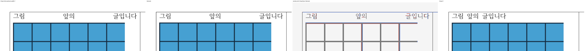

# Justification before inline objects

Rauhwpx left-packed a short line before an inline picture even though the paragraph requested Justify. Hancom spreads its three words across the cell. The engine now retains justification for automatic wrapping before the object and permits large spacing when the object cannot fit in the remaining width. Explicit newlines, paragraph endings and unrelated stale-layout stretch safeguards remain protected.

The private reference is the exact `cell-mixed-text/edited.hwpx` in the Mac Hancom XML 1.4 capture set. Its SHA-256 is `b12e7544011590d334888fa0c076590b76730818227a06a5370ae21eff69c491`; the observed Hancom 12.30.0 build 6446 PDF hash is `619d834bbf42c09605ecfce2409549043f09194b31769caaf913f7cecd6d2318`.

The native comparison at 200 dpi and tolerance 4 improves worst-page mismatch from 5.02% to 0.00% and worst-band mismatch from 10.40% to 0.00%. Earlier `body-mixed-text` and `cell-paragraph-spacing` documents remain at 0.00%, with matching one-page counts. Six focused alignment tests pass, including automatic wrapping, stale object placement, explicit newline and paragraph-end guards.

Hancom's full alignment routine `0x331bdc..0x33201c` uses the last included LF/CR character for terminal eligibility and has no positive two-em stretch limit. Its current-range caller, opportunity producer and endpoint support routines are preserved in the private analysis repository's `docs/targeted-parity/inline-picture-justification/` and `data/targeted-parity/inline-picture-justification/`, analysis commit `da962011`. Eleven complete bodies comprise 6,012 instruction words. Manifests pin binary identities, next-function boundaries, body hashes and the alignment jump table; ledgers retain unresolved measurement dependencies.

Session artifacts are in `/tmp/rhwp-parity-hancom-six`. No reference input or PDF was changed. This evidence covers the measured layout behavior, rather than universal document or editing parity. The cumulative six-document and Studio results are recorded in the final run report.
