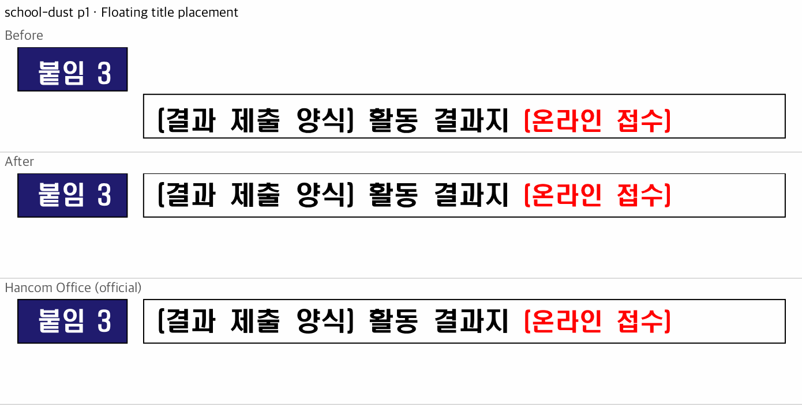
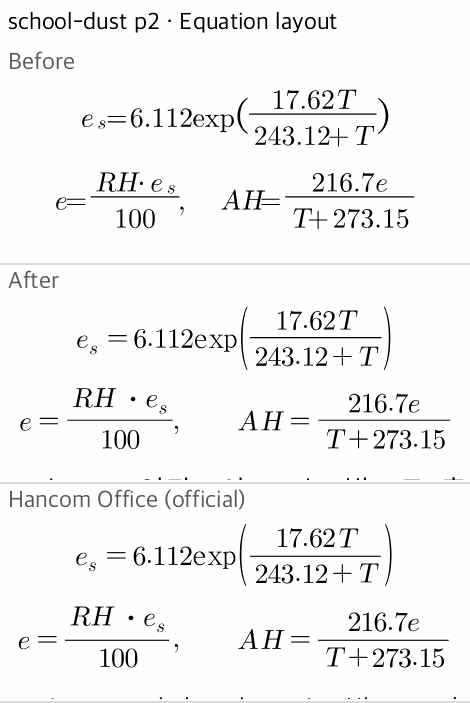

# School-report HWPX parity

Reference: a seven-page PDF exported by Hancom Office for macOS from the supplied report. The private source document, full-page captures, and proprietary fonts are not included.

The comparison uses 200 dpi renders and the Hancom parity harness. Percentages measure differing pixels after the harness tolerances; they are not raw pixel identity.

| Page | Native mismatch | Studio mismatch |
| --- | ---: | ---: |
| 1 | 0.00% | 0.00% |
| 2 | 0.00% | 0.00% |
| 3 | 0.00% | 0.00% |
| 4 | 0.00% | 0.00% |
| 5 | 0.02% | 0.02% |
| 6 | 0.02% | 0.06% |
| 7 | 0.00% | 0.00% |

The original renderer produced five pages instead of seven, with an 81.68% worst-page mismatch. Both final renderers produce seven pages. Review of all 70 comparison bands found no high or medium visual defects; residual differences are font-edge and raster rounding noise.

The title comparison starts with the original renderer. The equation comparison below starts after the initial pagination fixes, so all three crops show the same content.

## Browser verification

Studio imports eleven reference fonts through the production font-import event, including HYhwpEQ and Times New Roman Bold. Importing before or after opening the document produces pixel-identical captures on all seven pages, with zero browser errors. A fresh context without direct imports also renders seven pages without errors; the desktop font loader supplies system fonts in that control.

## Scope and regression checks

Compatibility metadata scopes generated line metrics and table flow to MS Word HWPX. Equation geometry uses modern source-font metrics only when the matching font is available; legacy HFT and fallback behavior remain separate. Generated equation line corrections live in the render projection and preserve authored source geometry. Fraction clearance, declaration boundaries, and neighboring non-fraction content have focused behavioral coverage.

Controlled Hancom exports check source-font availability, explicit and implicit equation spacing, fraction children, script placement, and saved-height independence at multiple font sizes. In a separate 20 pt fraction control, the native bar center remains 0.7 pt above the reference with the correct 0.8 pt stroke; no fitted offset was added. This does not affect the target report's visual-parity verdict.

The final complete Rust run (`cargo test --profile release-test --features native-skia --no-fail-fast`) recorded 5,208 passes, five existing base failures, and 66 ignored tests. No newly failing test remains.

The five failures also reproduce on current main `a4e301b8`:

- `sample16_hwp5_2022_page3_latin_font_matches_legacy_hancom_mapping`
- `issue_1139_endnote_equation_cursor_rects_do_not_rewind_to_line_start`
- `issue_1256_2022_sep_page10_question12_keeps_between_notes_gap`
- `issue_1549_multi_positive_float_host_title_renders_above_tables`
- `visible_host_title_still_pushes_its_float_table_down`

Studio unit tests: 2,498 passed, one skipped. WASM and native builds, TypeScript, Rust formatting, and whitespace checks pass. Earlier direct edit/undo checks preserved the report's visible seven-page layout; bibliography undo can coalesce adjacent same-style JSON runs.
